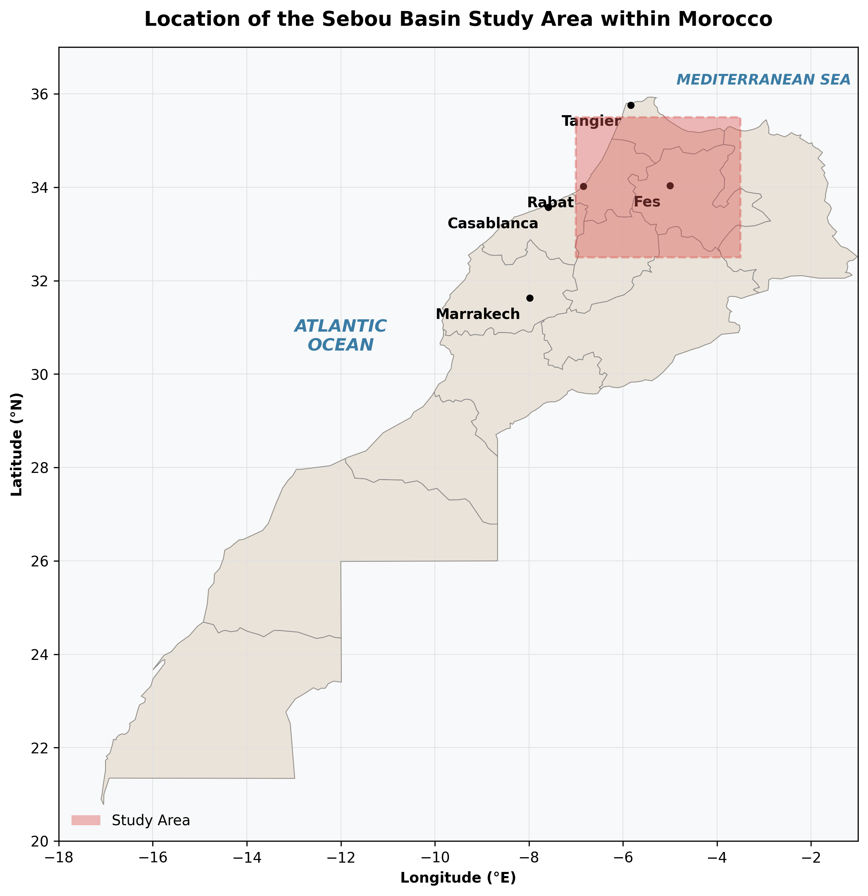
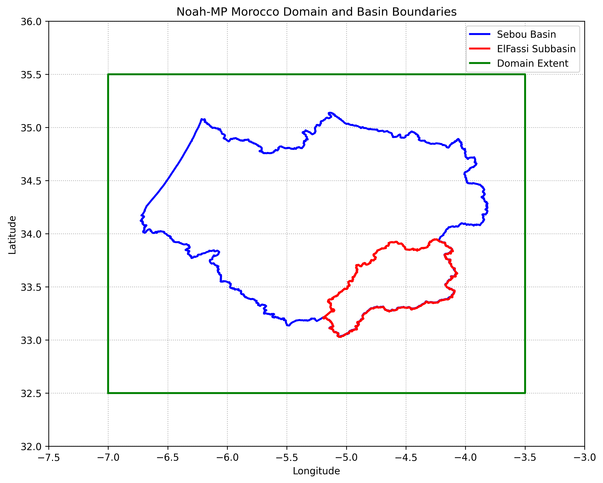

# Noah-MP Morocco Domain Definition
> **Author:** M. EL Aabaribaoune (@um6p)

This directory (`domain/`) consolidates all components related to defining the computational domain for the LIS/Noah-MP simulations over the Sebou and El Fassi subbasins in Morocco.

## Contents
- `shapefiles/`: Contains the ESRI Shapefiles defining the exact boundaries of the Sebou River Basin and El Fassi subbasin.
- `find_bounds.py`: A Python script that dynamically reads these shapefiles, transforms them to WGS84 Geographic coordinates (`EPSG:4326`), calculates the required simulation bounding box, and visualizes the domain.
- `domain_plot.png`: A visual plot showing the spatial extent of the boundaries and the overlapping grid.

## Domain Boundaries
The bounds have been formulated to encapsulate both the Sebou Basin and the El Fassi Subbasin with a small buffer. 

*   **Minimum Longitude (Lower Left x):** `-7.00`
*   **Maximum Longitude (Upper Right x):** `-3.50`
*   **Minimum Latitude (Lower Left y):** `32.50`
*   **Maximum Latitude (Upper Right y):** `35.50`

## Grid Characteristics
Based on a target spatial resolution of `0.01` degrees (~1 km):
- **Number of longitude points (dx):** `351`
- **Number of latitude points (dy):** `301`
- **Total number of grid cells:** `105,651`

## Domain Location Context
The image below shows the geographical location of the chosen domain in relation to the entire map of Morocco (including the Sahara).

## Detailed Visual Representation
The image below illustrates a closer look at the bounding box encapsulating the specific subbasins (Sebou and El Fassi). 

*(Note: If you are rendering this Markdown document as a PDF, ensure the `domain_plot.png` image resides in the same folder as this file.)*
